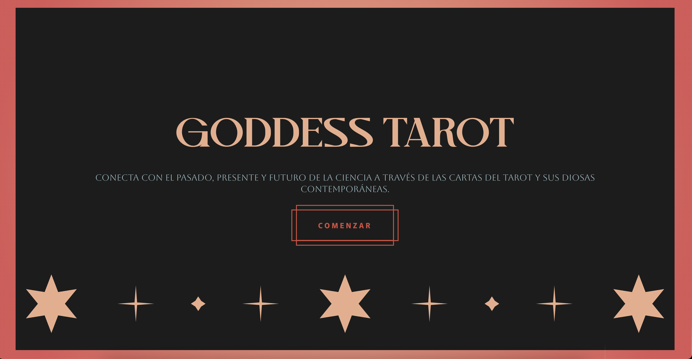
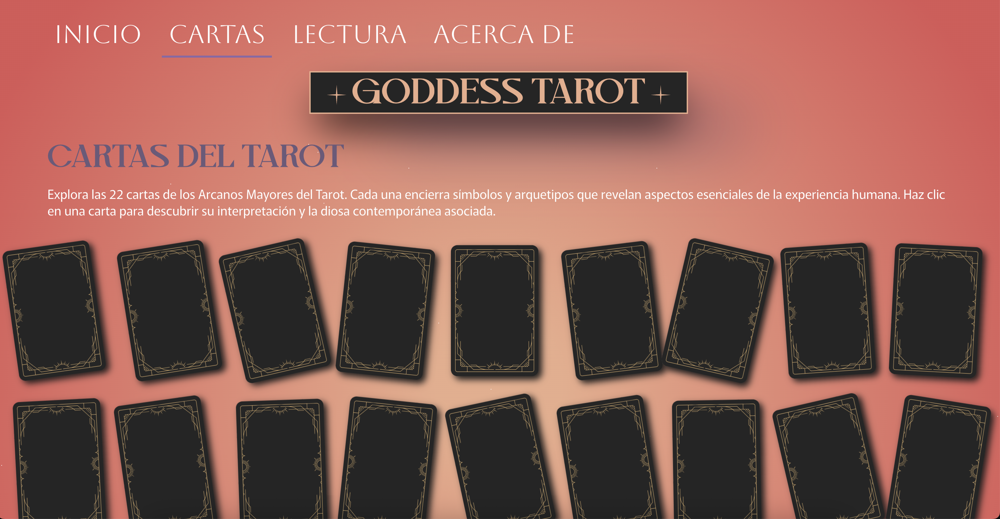
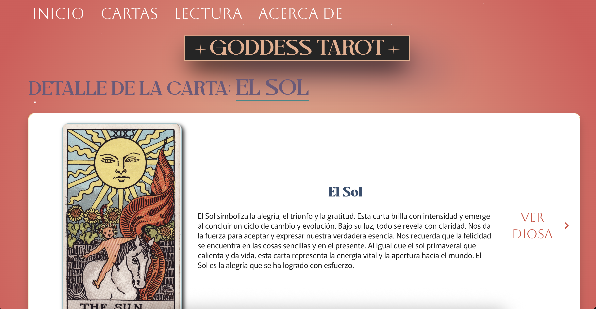
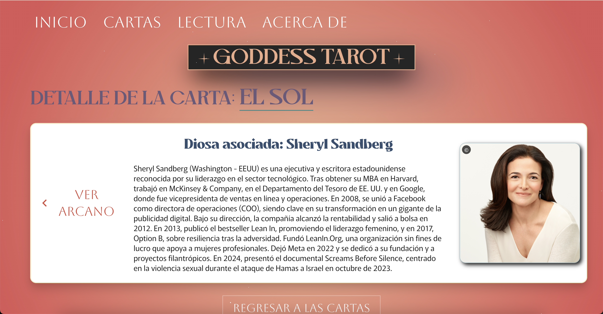
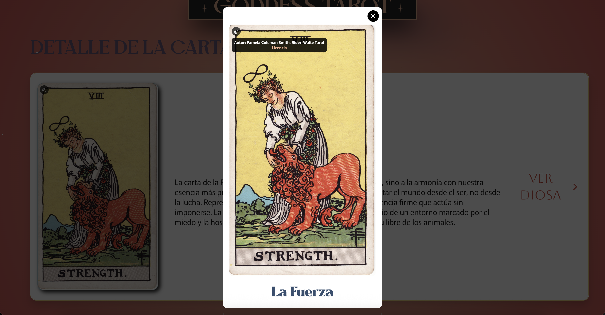
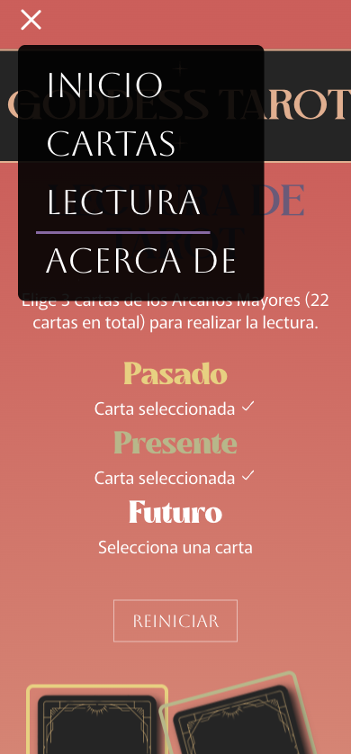
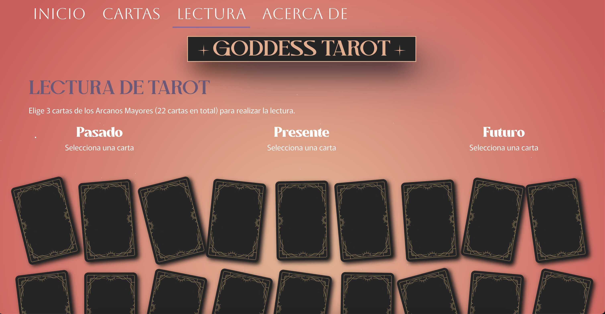
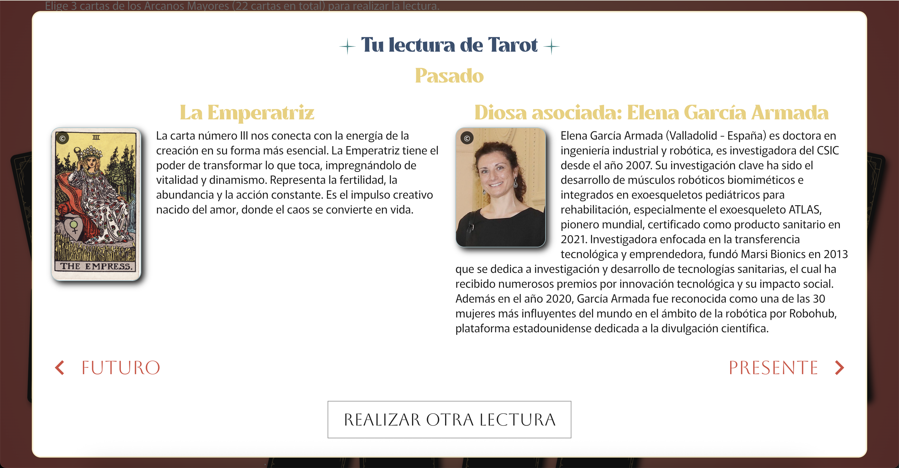

# 🌙 Goddess Tarot  

Aplicación web interactiva de tarot que combina arcanos mayores con diosas contemporáneas STEM (Science, Technology, Engineering, Mathematics)
Permite explorar cartas, obtener información detallada y realizar lecturas guiadas de Pasado, Presente y Futuro.  

---

## ✨ Características  

### Nivel 1: Exploración de cartas  
- **Página bienvenida**: presentación de la web.  




- **Página principal**: muestra todas las cartas boca abajo.  



- **Detalle de carta**: vista individual con información sobre el arcano y la diosa STEM asociada.  





- **Modal de imagen**: permite ampliar las cartas en pantalla completa. 



- **Diseño responsive**: accesible para todos los dispositivos. 


 

### Nivel 2: Lectura de cartas (Pasado, Presente, Futuro)  
- **Selección guiada**: escoger exactamente 3 cartas.  



- **Lectura de posiciones específicas**: asignación a Pasado, Presente y Futuro.  


 

## 🚀 Instalación y uso  

### Prerrequisitos  
- Node.js (versión 16 o superior)  
- npm o yarn

### Pasos de instalación  

1. Instalar dependencias:  
   ```bash
   npm install

2. Ejecutar en desarrollo:
    ```bash
    npm run dev

La aplicación estará disponible en [localhost](http://localhost:5173/)


## 📁 Estructura del proyecto
     
    STEM-TAROT/
    ├──public/
    │   ├── favicon                  # Icono favicon
    │   └── images                   # Reverso de carta
    ├──.gitignore                    # Archivos que no se deben subir a GitHub
    ├──index.html                    # Archivo HTML principal
    ├──package.json                  # Define las dependencias, scripts y metadatos del proyecto.
    ├──package-lock.json             # Registra las versiones exactas de las dependencias instaladas.
    ├──README.md                     # Documentación del proyecto
    └──src/
        ├── assets / fonts            
        │   ├── Mullingar/           # Tipografía
        │   └── MvokyDEMO/           # Tipografía
        ├── components/           
        │   ├── Header/              # Encabezado con nombre de la página
        │   ├── Footer/              # Footer con créditos
        │   ├── Navbar/              # Menú de navegación
        │   ├── Layout/              # Elementos comunes de todo el sitio web
        │   ├── StyledButton/        # Botones reutilizables 
        │   ├── ScrollToTopButton/   # Botón para volver arriba en versión móvil        
        │   └── CursorTrail/         # Efecto visual interactivo en el cursor
        │   └── Line/                # Efecto visual en LandingPage
        │   └── GalaxyBackground/    # Efecto visual de fondo
        ├── pages/    
        │   ├── LandingPage.tsx      # Página introductoria         
        │   ├── HomePage.tsx         # Página principal (todas las cartas)
        │   ├── CardDetailPage.tsx   # Detalle de carta
        │   ├── ReadingPage.tsx      # Página de lectura de 3 cartas
        │   └── AboutPage.tsx        # Información sobre el proyecto
        ├── services/            
        │   └── tarotService.ts      # Funciones para consumir la API
        ├── router/            
        │   └── index.tsx            # Configuración de rutas
        ├── types/            
        │   └── tarot.ts             # Tipado
        ├── index.css                # Estilos globales
        └── main.jsx                 # Punto de entrada

## 🔗 API
    La aplicación consume la API pública de tarot STEM
    
    https://6872278c76a5723aacd3cbb3.mockapi.io/api/v1/tarot
    
    Ejemplo de estructura de una carta:
    
     {
     "id": "1",
     "arcaneNumber": "0",
     "arcaneName": "El Loco",
     "arcaneDescription": "Descripción detallada del significado de la carta.",
     "arcaneImage": {
       "imageSrc": "URL de la imagen de la carta",
       "author": "Autor de la imagen",
       "license": "Licencia de uso"
     },
     "goddessName": "Nombre de la diosa contemporánea asociada",
     "goddessDescription": "Descripción biográfica o información relevante sobre la diosa contemporánea.",
     "goddessImage": {
       "imageSrc": "URL de la imagen de la diosa",
       "author": "Autor de la imagen",
       "licenseUrl": "URL de la licencia de uso"
     }
    }
       

## 🛠️ Tecnologías utilizadas
- **React**: Framework principal 
- **React Router DOM**: Navegación entre páginas  
- **Vite**: Servidor de desarrollo rápido  
- **TypeScript**: Tipado estático para mayor robustez y mantenibilidad  
- **CSS3 / Módulos CSS**: Estilos, animaciones y responsive design  
- **Framer Motion**: Animaciones de carga para las cartas
- **React Icons**: Iconos reutilizables
- **Fetch API**: Consumo de la API REST  
- **JavaScript ES6+**: Funciones modernas y soporte avanzado  

## 🙏 Agradecimientos
Este proyecto educativo fue desarollado en colaboración con el equipo de FactoríaF5 de Barcelona. 
Agradecimiento especial a @MAlexGG por la creación de la API de tarot utilizada.
